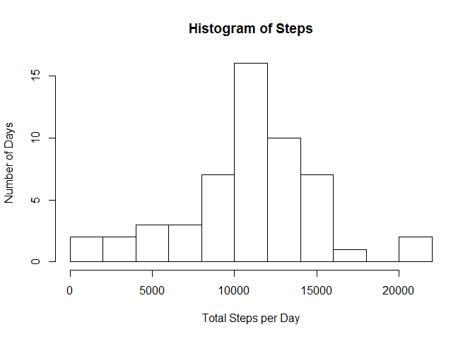
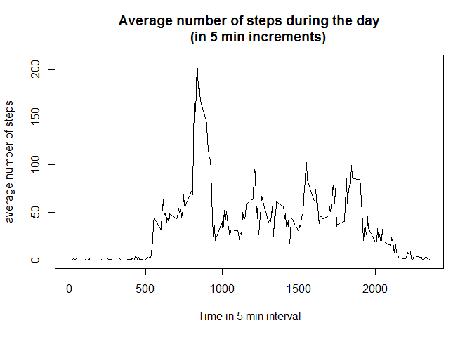
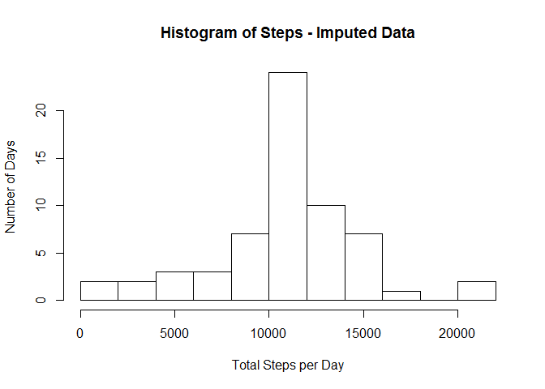
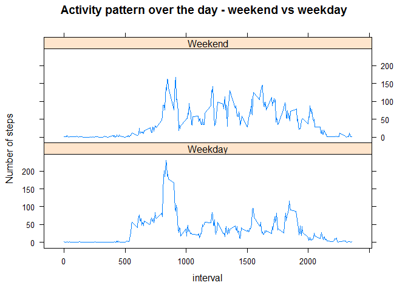

# Reproducible Research: Peer Assessment 1

## Loading and preprocessing the data

```r
allact <- read.csv("activity.csv") #read datafile
allact$date <- as.Date(allact$date) #convert factor to Date
completeact <- allact[complete.cases(allact),] # subset complete cases
naact <- allact[!complete.cases(allact),] # save NA for impute action
str(completeact,3) #show subset with complete activities
```

```
## 'data.frame':	15264 obs. of  3 variables:
##  $ steps   : int  0 0 0 0 0 0 0 0 0 0 ...
##  $ date    : Date, format: "2012-10-02" "2012-10-02" ...
##  $ interval: int  0 5 10 15 20 25 30 35 40 45 ...
```

```r
require(knitr)
```

```
## Loading required package: knitr
```

```
## Warning: package 'knitr' was built under R version 3.2.2
```

```r
opts_chunk$set(fig.path = "./figures/") # set figures directory
```

## What is mean total number of steps taken per day?
The histogram shows the distribution of activity over days 
(every day about the same activity or some days far more than others)

```r
histact <- aggregate(steps ~ date, 
                     data = completeact, sum) #summarize steps per day
actmedian <- format(median(histact$steps), nsmall = 1) # calc median
actmean <- format(mean(histact$steps), nsmall = 1) # and mean
histplot <- hist(histact$steps, breaks = 11, freq = TRUE, 
                 main = "Histogram of Steps", 
                 xlab = "Total Steps per Day", 
                 ylab = "Number of Days")
```

 

This is roughly a Bell-shape distribution with 2 days with 20k+ steps.

The **median** of the total number of steps per day is: 10765
and the **mean** is: 10766.19


## What is the average daily activity pattern?

```r
# calculate average steps per interval over all days
avgact <- aggregate(steps~interval, data = completeact, mean) 
maxavgact <- avgact[which.max(avgact$steps),1]
plot(avgact$interval, avgact$steps, type = "l",
     xlab = "Time in 5 min interval",
     ylab = "average number of steps",
     main = "Average number of steps during the day
     (in 5 min increments)") # plot time series
```

 

On average the maximum number of steps are made in **interval**: 835

This corresponds with interval: 8.35 - 8.39 AM

## Imputing missing values

```r
nrmissing <- sum(!complete.cases(naact))
```
The total number of missing values is: 2304

Missing values are imputed using the average number of steps in that interval over all days with valid data 
(fortunately this was already calculated in the average daily pattern). 
The histogram based on this imputed dataset shows a higher number of 'average' days, caused by the imputing mechanism.

```r
naact$steps <- avgact$steps # replace NA with average number of steps
imputedact <- rbind(completeact, naact) #combine complete and imputed NA
histimputedact <- aggregate(steps ~ date, 
                            data = imputedact, sum) #summarize steps per day
impmedian <- format(median(histimputedact$steps), nsmall = 1) # calc median
impmean <- format(mean(histimputedact$steps),nsmall = 1)  # and mean for imputed data
histplot2 <- hist(histimputedact$steps, breaks = 11, freq = TRUE, 
                  main = "Histogram of Steps - Imputed Data", 
                  xlab = "Total Steps per Day", 
                  ylab = "Number of Days")
```

 

The **median** of the total number of steps per day (imputed data) is:10766.19 and the **mean** is: 10766.19

Impact from imputing:

**Mean**: For the imputed data the mean is the same for imputed en non-imputed data: this is caused by the impute strategy: using the average number of steps per day (= mean) for the previous NA-data, imputing causes no different data (only mean, no outliers)

**Median**: The median shifts from slightly under mean for non-imputed data to identical to mean. This is caused by imputing 2304 extra valid measurements with value = mean ; imputing introduces 2304 extra 'mean' values = + 15%.
This is also shown in both histograms

## Are there differences in activity patterns between weekdays and weekends?


```r
invisible(Sys.setlocale("LC_TIME", "C")) #set US days (my PC works in different enviroment)
imputedact <-
        transform(imputedact, whatday = ifelse(  #extra factor whatday
        weekdays(date) %in% c("Sunday","Saturday"),
        "Weekend","Weekday"  # with weekday and weekend as factors
        ))
avgimputed <- aggregate(steps~interval + whatday, data = imputedact, mean)
library(lattice)
xyplot(steps~interval|whatday, # plot steps versus interval, group by weekend
       data = avgimputed, # using dataset avgimputed
       type = "l",  # line type
       layout = c(1,2), # with one plot above the other
       xlab = "interval", ylab = "Number of steps",
       main = "Activity pattern over the day - weekend vs weekday")
```

 

Yes: there are some differences. Based on the plot the peak in weekdays is higher (230 vs 166), but the weekends have a higher activity pattern on average (42 vs 36). Also note that activity in weekends starts later than during weekday: he/she likes to sleep longer in the weekend.
